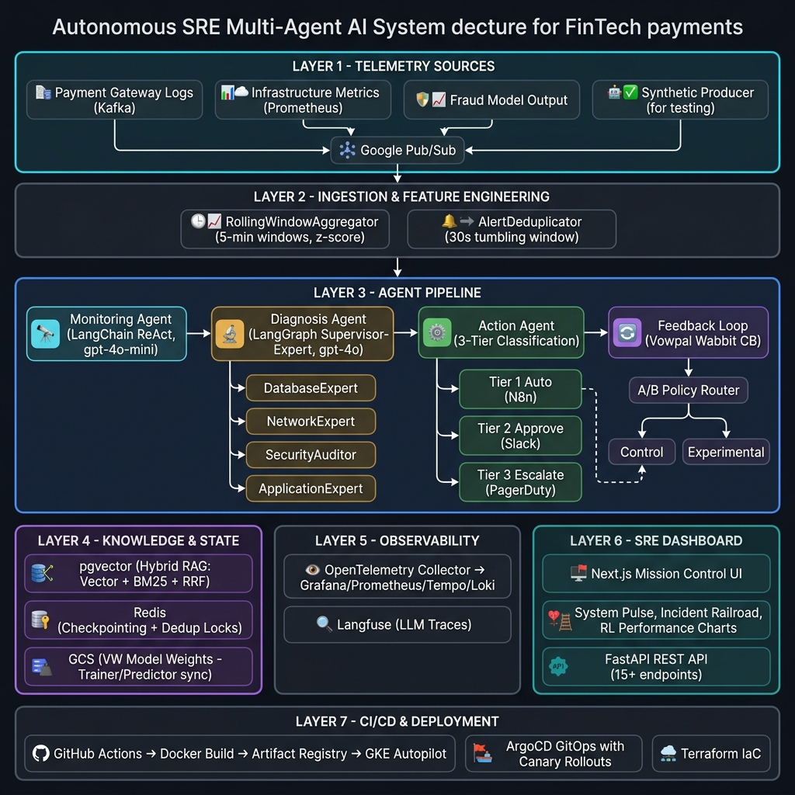
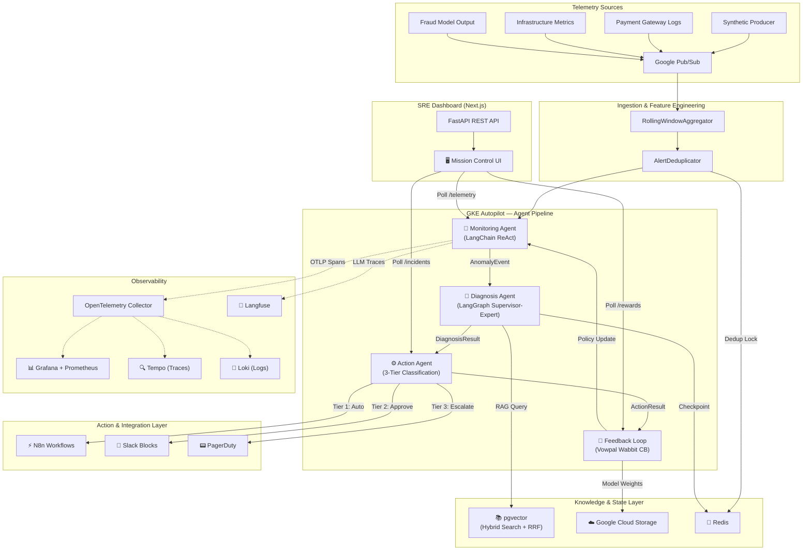
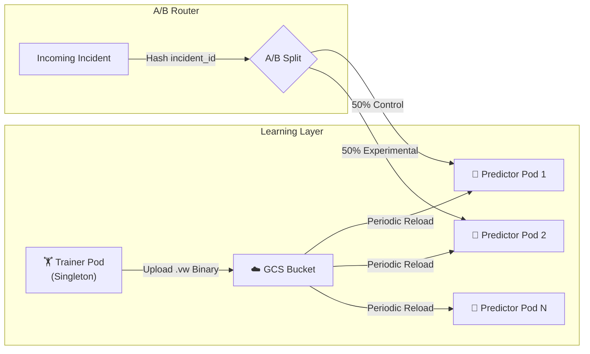
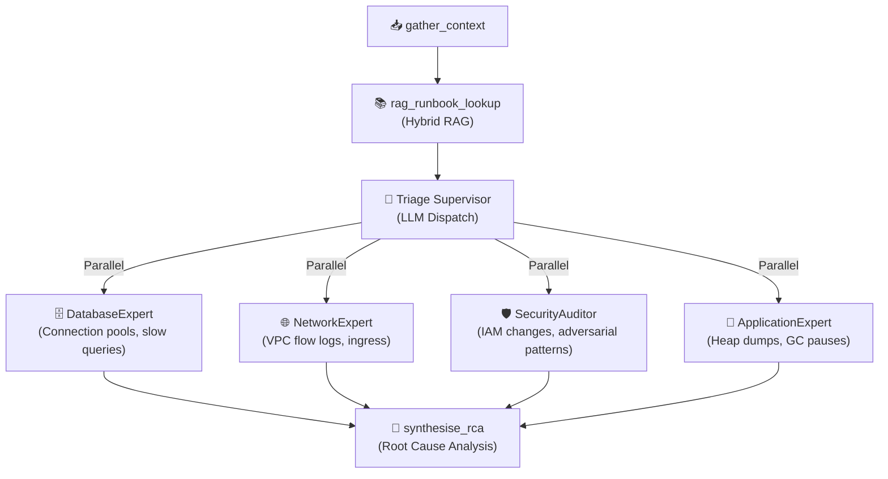
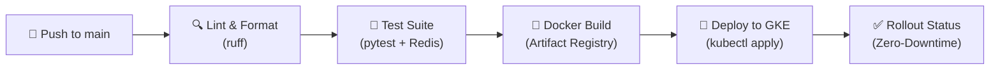
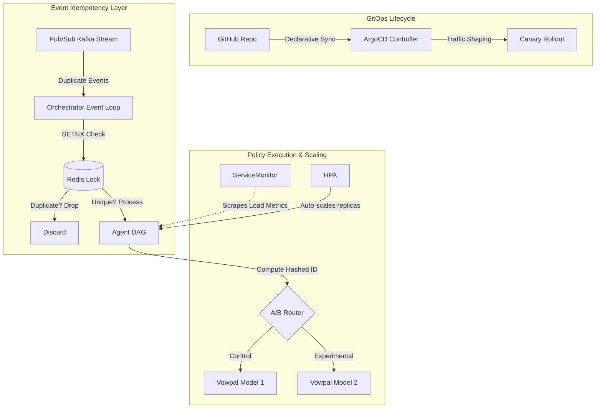

# 24/7 Service Reliability & Anomaly-Response Agent System

> End-to-end multi-agent AI system monitoring payment transaction flows at scale using **LangChain + LangGraph + CrewAI**, with autonomous detection, diagnosis, remediation, and continuous reinforcement learning.


---

## Table of Contents

1. [Project Overview](#-project-overview)
2. [Architecture Evolution Timeline](#-architecture-evolution-timeline)
3. [System Architecture](#-system-architecture-distributed-v3)
4. [Agent Pipeline Deep Dive](#-agent-pipeline-deep-dive)
5. [Phase-by-Phase Implementation Log](#-phase-by-phase-implementation-log)
6. [Real-Time SRE Dashboard](#-real-time-sre-dashboard)
7. [CI/CD Pipeline](#-cicd-pipeline)
8. [Quick Start Guide](#-quick-start-guide)
9. [Project Structure](#-project-structure)
10. [API Reference](#-api-reference)
11. [Observability Stack](#-observability-stack)
12. [Testing & Chaos Engineering](#-testing--chaos-engineering)
13. [Security & Authentication](#-security--authentication)
14. [Known Limitations & Future Work](#-known-limitations--future-work)

---

## 🎯 Project Overview

This project implements a **fully autonomous Site Reliability Engineering (SRE) agent** for FinTech payment systems. The system continuously ingests telemetry from payment gateways, infrastructure metrics, and fraud detection models, then autonomously detects anomalies, diagnoses root causes using RAG-augmented reasoning, executes tiered remediations, and learns from outcomes via online reinforcement learning.

### Full System Architecture



### Core Capabilities

| Capability | Description |
|-----------|-------------|
| **Autonomous Anomaly Detection** | LangChain ReAct agent with Isolation Forest and 5 custom SRE tools |
| **Multi-Expert Root Cause Analysis** | LangGraph Supervisor-Expert pattern dispatching parallel domain experts (DB, Network, Security, App) |
| **Tiered Automated Remediation** | 3-tier action classification with human-in-the-loop approval for destructive operations |
| **Online Reinforcement Learning** | Vowpal Wabbit contextual bandits with hybrid reward (metrics + LLM-as-Judge) |
| **Real-Time SRE Dashboard** | Next.js cyberpunk-themed mission control with live telemetry pulse, incident railroad mapping, and RL performance visualization |
| **PagerDuty Lifecycle Sync** | Automated incident creation, deduplication (Code 2002 handling), and resolution |

### Target SLOs

| Metric | Target | Method |
|--------|--------|--------|
| **MTTA** (Mean Time to Acknowledge) | < 90 seconds | Autonomous triage replaces human pager response |
| **MTTR** (Mean Time to Remediate) | < 8 minutes | Tier 1 auto-execution, Tier 2 Slack approval flow |
| **False Positive Rate** | < 5% | RL feedback loop continuously improves detection precision |
| **Data Quality Score** | ≥ 95% recall | Anomaly detection recall on transaction schema violations |

---

## 📐 Architecture Evolution Timeline

The system evolved through distinct architectural phases, each adding capabilities while maintaining backward compatibility.

```mermaid
graph LR
    A["Phase 1<br/>v1 Architecture<br/>(8-Phase Design Doc)"] --> B["Phase 2<br/>v1 Implementation<br/>(Core Agent Pipeline)"]
    B --> C["Phase 3<br/>v2 Architecture<br/>(+LLM Observability)"]
    C --> D["Phase 4<br/>Audit & Hardening<br/>(Claude Walkthrough)"]
    D --> E["Phase 5<br/>Gap Remediation<br/>(Priority 1/2/3 Fixes)"]
    E --> F["Phase 6<br/>SRE Dashboard<br/>(Next.js Frontend)"]
    F --> G["Phase 7<br/>CI/CD Stabilization<br/>(GitHub Actions)"]

    style A fill:#1a5fb8,stroke:#3d8ef0,color:#fff
    style B fill:#22c55e,stroke:#6ee7a0,color:#000
    style C fill:#f59e0b,stroke:#fcc94a,color:#000
    style D fill:#a78bfa,stroke:#c4b0ff,color:#000
    style E fill:#22c55e,stroke:#6ee7a0,color:#000
    style F fill:#3d8ef0,stroke:#7eb8ff,color:#fff
    style G fill:#14b8a6,stroke:#6ee7a0,color:#000
```



### Phase 1 — Original Architecture Design (`agentic-ai-architecture.html`)

The foundational blueprint covering all 8 phases of the system lifecycle:

- **Phase 00**: Research & Planning — Domain analysis, stakeholder mapping, technology evaluation matrix, risk register
- **Phase 01**: Data Architecture — 7 data sources, Kafka/Flink streaming pipeline, pgvector knowledge store, Great Expectations quality gates
- **Phase 02**: High-Level Design — 4-agent topology (Monitor→Diagnose→Act→Feedback), cross-cutting concerns (security, observability, state)
- **Phase 03**: Low-Level Design — Per-agent internals, tool specs, API contracts, RAG pipeline, prompt engineering strategies
- **Phase 04**: Development — Repository structure, structured output enforcement, cost budget tracking, per-agent model routing
- **Phase 05**: Testing — Unit/integration/eval/chaos/load/property-based/adversarial test strategy
- **Phase 06**: Production — GKE Autopilot, Terraform IaC, Secret Manager CSI, Helm charts, CI/CD pipeline
- **Phase 07**: Post-Production — Grafana dashboards, weekly ops reviews, scaling roadmap

### Phase 2 — v1 Implementation (Core Agent Pipeline)

Translated the design into a working codebase with several strategic architectural pivots:

1. **Self-Hosted Privacy vs SaaS**: Replaced Datadog LLM Observability with self-hosted **Langfuse** and **Arize Phoenix** to guarantee zero PII escapes the network perimeter.
2. **Local-First RAG**: Bypassed costly Vertex AI Matching Engine with **pgvector** running alongside agents.
3. **API-First Stream Processing**: Replaced Apache Flink clusters with lightweight Python orchestration (`RollingWindowAggregator`, `AlertDeduplicator`).
4. **Action Engine Abstraction**: N8n workflows gracefully mocked via Python dry-runs; the 3-tier classification logic remains fully intact.
5. **Consolidated Serverless Footprint**: Consolidated onto **GKE Autopilot** instead of fragmented GKE + Cloud Run deployments.

### Phase 3 — v2 Architecture: LLM Observability (`agentic-ai-architecture-obs.html`)

Added a comprehensive LLM observability layer with three monitoring tiers:

| Tier | Tool | Role | Status |
|------|------|------|--------|
| **Primary** | Langfuse (Self-Hosted) | LLM trace collection, prompt versioning, session scoping | Scaffolded (Docker + code wired, import conditionally disabled) |
| **RAG Quality** | Arize Phoenix | Embedding drift, retrieval relevance, hallucination detection | Docker running, no span forwarding yet |
| **SRE View** | Datadog LLM Obs | Sanitized OTLP export for operations teams | Not connected |

### Phase 4 — Architecture Audit (`claude_walkthrough.md`)

A comprehensive code-vs-design validation produced a maturity scorecard and identified critical gaps:

| Area | Score |
|------|-------|
| Agent Pipeline (Mon→Diag→Act→Feedback) | ⬛⬛⬛⬛⬜ 4/5 |
| LangGraph + Supervisor-Expert Pattern | ⬛⬛⬛⬛⬜ 4/5 |
| Reinforcement Learning (VW Bandit) | ⬛⬛⬛⬛⬜ 4/5 |
| LLM Observability (Langfuse) | ⬛⬛⬛⬜⬜ 3/5 |
| RAG Pipeline (Knowledge Base) | ⬛⬛⬜⬜⬜ 2/5 |
| Infrastructure (GKE/Terraform) | ⬛⬛⬛⬛⬜ 4/5 |
| CI/CD (GitHub Actions) | ⬛⬛⬜⬜⬜ 2/5 |

### Phase 5 — Gap Remediation (Priority 1/2/3 Fixes)

Systematically closed the audit gaps across all priority tiers:

#### Priority 1 (High Impact) — Completed
- **RAG Pipeline — Real Hybrid Search**: Implemented full vector + BM25 + Reciprocal Rank Fusion (RRF) search in `knowledge_base/retrieval/search.py`, with **Cohere cross-encoder reranking** (`rerank-english-v3.0`)
- **Runbook Ingestion Pipeline**: Built document chunking (512 tokens, 64 overlap) and embedding pipeline in `knowledge_base/ingestion/pipeline.py`
- **LangGraph Checkpointing**: Added state checkpointing to the diagnosis graph (initially Redis, now MemorySaver for local dev compatibility)
- **Langfuse Integration**: Wired `CallbackHandler` throughout agents with session scoping by `incident_id`

#### Priority 2 (Medium Impact) — Completed
- **PII Sanitization**: Added `sanitize_for_llm()` utility in `shared/pii.py` for masking sensitive data before LLM calls
- **GitHub Actions CI Pipeline**: Full 4-stage pipeline (Lint → Test → Build → Deploy) in `.github/workflows/main.yml`
- **Cost Budget Enforcement**: `LLMCostTracker` with per-agent token tracking and `max_tokens_per_incident = 50,000` ceiling

#### Priority 3 (Lower Impact) — Completed
- **Redis Distributed Locks**: Idempotency layer via Redis `SETNX` preventing duplicate incident processing
- **RL Policy A/B Testing**: Deterministic `incident_id` hashing routes 50% of decisions to Control vs Experimental policies
- **Cost Boundary Hard Enforcement**: `BudgetExceededError` circuit breaker halts LLM execution and escalates to human SREs
- **ArgoCD GitOps**: Declarative cluster management with canary releases (20% → 50% → 100% traffic shifting)
- **Dynamic HPA Autoscaling**: Prometheus ServiceMonitors driving Horizontal Pod Autoscalers on LLM usage metrics

### Phase 6 — Real-Time SRE Dashboard

Built a cyberpunk-themed **Next.js 16** frontend dashboard polling the FastAPI backend:

- **System Pulse**: Real-time scatter plot of telemetry events color-coded by anomaly status
- **Active Response Workflows**: Railroad-style incident lifecycle visualization (Detected → Diagnosing → Mitigating → Resolved)
- **RL Policy Performance (A/B)**: Cumulative reward comparison between Control and Experimental RL policies
- **Status Cards**: Live counts of active/resolved incidents and current policy version
- **Connection Status Indicator**: Real-time backend health monitoring with automatic retry logic
- **Background Telemetry Heartbeat**: Continuous synthetic metric injection to maintain dashboard liveness

### Phase 7 — CI/CD Pipeline Stabilization

Fixed and hardened the GitHub Actions pipeline:
- Resolved `ruff` version pinning and format check compatibility issues
- Fixed `PYTHONPATH` configuration for proper module resolution in CI
- Added Redis service container for integration tests
- Implemented JUnit XML test report uploads as build artifacts
- Stabilized the Docker build → Artifact Registry → GKE deploy chain
- Added `kubectl rollout status` monitoring for zero-downtime deployments

---

## 🏗️ System Architecture (Distributed v3)



### Distributed RL Architecture (Trainer-Predictor Split)



---

## 🤖 Agent Pipeline Deep Dive

### Agent Specifications

| Agent | Framework | Model | Core Technology | Key Files |
|-------|-----------|-------|-----------------|-----------|
| **Monitoring** | LangChain ReAct | `gpt-4o-mini` | Isolation Forest, 5 custom SRE tools, confidence threshold 0.75 | `agents/monitoring/agent.py`, `agents/monitoring/tools.py` |
| **Diagnosis** | LangGraph (Supervisor-Expert) | `gpt-4o` | Parallel domain experts, RAG runbook retrieval, Redis checkpointing | `agents/diagnosis/graph.py`, `agents/diagnosis/experts.py` |
| **Action** | N8n + Slack + PagerDuty | `gpt-4o` | 3-tier classification, idempotency keys, automatic rollbacks | `agents/action/agent.py`, `agents/action/pagerduty.py` |
| **Feedback** | Vowpal Wabbit | `gpt-4o-mini` | `cb_explore_adf` contextual bandits, GCS model sync, epsilon-greedy exploration | `agents/feedback/agent.py` |
| **Reward** | LLM-as-Judge | `gpt-4o-mini` | 3-dimension qualitative evaluation (correctness, speed, impact) | `agents/feedback/reward_agent.py` |

### Diagnosis Agent — Supervisor-Expert Pattern

The Diagnosis Agent was refactored from a linear 4-node DAG to a sophisticated **Supervisor-Expert model** mimicking real-world SRE triage:



### 3-Tier Action Classification

| Tier | Scope | Approval | Examples |
|------|-------|----------|----------|
| **Tier 1** | Non-destructive | Auto-execute | Scale replicas, restart pods, flush caches |
| **Tier 2** | Potentially disruptive | Slack human approval | Database failover, traffic rerouting |
| **Tier 3** | Critical / unknown | PagerDuty escalation | Schema rollback, full service drain |

### Pydantic API Contracts

All inter-agent communication flows through strictly typed Pydantic v2 models:

| Contract | Direction | Schema File |
|----------|-----------|-------------|
| `TelemetryEvent` | Source → Monitor | `shared/schemas.py` |
| `AnomalyEvent` | Monitor → Diagnosis | `shared/schemas.py` |
| `DiagnosisResult` | Diagnosis → Action | `shared/schemas.py` |
| `ActionResult` | Action → Feedback | `shared/schemas.py` |
| `SemanticReward` | Reward Agent → Feedback | `shared/schemas.py` |
| `IncidentRecord` | Full lifecycle wrapper | `shared/schemas.py` |

---

## 📋 Phase-by-Phase Implementation Log

This section documents every significant implementation step taken during the project, in chronological order.

### Stage 1 — Foundation & Scaffolding
- Created project structure matching the 8-phase architecture design
- Set up Poetry dependency management with `pyproject.toml`
- Configured `docker-compose.yml` for full local dev stack (Kafka, Redis, PostgreSQL/pgvector, N8n, Prometheus, Grafana, Loki, Tempo, OTel Collector, Langfuse, Arize Phoenix)
- Implemented centralized configuration via `shared/config.py` using `pydantic-settings`
- Defined all Pydantic schemas in `shared/schemas.py`

### Stage 2 — Monitoring Agent
- Built LangChain ReAct agent with 5 custom SRE tools
- Implemented Isolation Forest-based anomaly detection
- Created the `SyntheticTelemetryProducer` for realistic test data generation
- Added confidence threshold gating (0.75) to reduce false positives

### Stage 3 — Diagnosis Agent (LangGraph)
- Implemented initial 4-node DAG (gather_context → rag_runbook_lookup → dispatch_subagents → synthesise_rca)
- **Evolved** from CrewAI crew dispatch to **Supervisor-Expert pattern** with LLM-powered triage
- Created 4 parallel domain experts (Database, Network, Security, Application)
- Added synthetic runbook fallbacks for development mode

### Stage 4 — Action Agent & Integrations
- Built 3-tier action classification engine
- Integrated PagerDuty for Tier 3 escalations with dedup key support
- Implemented Slack Interactive Blocks for Tier 2 human-in-the-loop approvals
- Added N8n workflow execution (with dry-run simulation mode)
- **Hardened PagerDuty**: Added Code 2002 duplicate handling (returns success instead of error) and programmatic resolution via `resolve_pagerduty_incident()`

### Stage 5 — Feedback Loop & Reinforcement Learning
- Replaced planned Vertex AI RL with **Vowpal Wabbit** `cb_explore_adf` for online learning
- Implemented hybrid reward function combining extrinsic metrics (MTTR, FP rate) with intrinsic LLM-as-Judge evaluation
- Created the `RewardAgent` using GPT-4o-mini for 3-dimension qualitative assessment
- Built **Trainer-Predictor distributed architecture** with GCS model synchronization
- Added A/B policy testing via deterministic `incident_id` hashing

### Stage 6 — Knowledge Base & RAG Pipeline
- Implemented real hybrid search in `knowledge_base/retrieval/search.py`:
  - Dense vector search (cosine similarity via pgvector)
  - Sparse BM25 keyword search (PostgreSQL trigram similarity)
  - Reciprocal Rank Fusion (RRF) to merge results
  - **Cohere cross-encoder reranking** (`rerank-english-v3.0`) for precision boosting
- Built document ingestion pipeline with 512-token chunks and 64-token overlap
- Created pgvector migration schemas

### Stage 7 — v2 LLM Observability Integration
- Added Langfuse `CallbackHandler` integration throughout all agents
- Implemented per-incident session scoping (`session_id = incident_id`)
- Configured Arize Phoenix Docker service for RAG quality monitoring
- Added `LLMCostTracker` with per-agent token spend tracking

### Stage 8 — Architecture Audit & Gap Remediation
- Conducted comprehensive code-vs-design audit (`claude_walkthrough.md`)
- Implemented Redis distributed locks for event idempotency
- Added `BudgetExceededError` circuit breaker for cost enforcement
- Created ArgoCD manifests for GitOps deployment
- Configured HPA autoscaling driven by Prometheus ServiceMonitors
- Built chaos engineering suite (`scripts/run_chaos_experiments.py`):
  - Distributed Amnesia (Redis outage simulation)
  - Stubborn Tool Faults (500 error mocking)
  - Adversarial Injection (prompt injection in telemetry)
- Added PII masking middleware (`shared/pii.py`)

### Stage 9 — Production Deployment
- Deployed to **GKE Autopilot** with Terraform IaC (`infra/terraform/`)
- Configured **GCP Secret Manager CSI Driver** for volume-mounted secrets
- Implemented **Workload Identity (ADC)** for keyless pod authentication
- Created separate Trainer and Predictor K8s deployments with fine-tuned health probes
- Built Docker multi-stage image (`infra/docker/Dockerfile`)

### Stage 10 — SRE Mission Control Dashboard
- Built **Next.js 16** cyberpunk-themed dashboard with Tailwind CSS and Recharts
- Implemented 5 core components:
  - `Dashboard.tsx` — Main layout with connection status indicator and anomaly injection button
  - `TelemetryPulse.tsx` — Real-time scatter plot of incoming telemetry events
  - `ActiveIncidents.tsx` — Railroad-style incident lifecycle visualization
  - `PolicyPerformance.tsx` — Cumulative reward A/B comparison chart
  - `StatusCards.tsx` — Live metric cards for active/resolved incidents
- Built centralized API client (`lib/api.ts`) with error logging and retry handling
- Added `suppressHydrationWarning` to resolve browser extension conflicts
- Implemented background telemetry heartbeat for continuous dashboard liveness
- Hardened CORS policy to support localhost, 127.0.0.1, and IPv6 origins

### Stage 11 — CI/CD Pipeline Stabilization
- Created GitHub Actions workflow (`.github/workflows/main.yml`) with 4 stages:
  1. **Lint & Format Check**: Pinned `ruff` version for reproducible linting
  2. **Unit, Integration & Eval Tests**: Redis service container, Poetry install, JUnit XML reports
  3. **Build & Push Docker Image**: Multi-tag strategy (SHA + latest) to Google Artifact Registry
  4. **Deploy to GKE**: `sed`-based image tag injection into K8s manifests, rollout status monitoring
- Fixed module resolution issues (`PYTHONPATH` configuration)
- Added test report artifact uploads

---

## 🖥️ Real-Time SRE Dashboard

The SRE Mission Control dashboard provides real-time operational visibility into the autonomous agent system.

### Dashboard Components

| Component | Description | Data Source |
|-----------|-------------|-------------|
| **System Pulse** | Scatter plot of telemetry events (green=normal, red=anomaly) | `GET /api/v1/telemetry/recent` |
| **Active Response Workflows** | Railroad map showing incident lifecycle stages | `GET /api/v1/incidents/active` |
| **RL Policy Performance** | Cumulative reward curves for Control vs Experimental policies | `GET /api/v1/feedback/rewards` |
| **Status Cards** | Active incidents, resolved count, policy version | `GET /api/v1/status` |
| **Connection Status** | Real-time backend connectivity indicator | `GET /api/v1/health/detailed` |

### Running the Dashboard

```bash
# Terminal 1: Start the FastAPI backend
poetry run uvicorn api:app --host 127.0.0.1 --port 8050 --reload

# Terminal 2: Start the Next.js frontend
cd dashboard
npm install
npm run dev
```

Then open **http://localhost:3000** in your browser.

---

## 🚢 CI/CD Pipeline

The project uses GitHub Actions for automated testing and deployment to GKE Autopilot.



### Pipeline Stages

| Stage | Trigger | Actions |
|-------|---------|---------|
| **Lint & Format** | Every push/PR | `ruff check`, `ruff format --check` |
| **Test** | After lint passes | Unit tests, integration tests (with Redis service), eval suite |
| **Build & Push** | Main branch only | Multi-stage Docker build → Google Artifact Registry |
| **Deploy to GKE** | After successful build | Image tag injection → `kubectl apply` → rollout status monitoring |

---

## 🚀 Quick Start Guide

### Prerequisites
- Python 3.11+
- Docker Desktop
- Node.js 18+ (for the dashboard)
- At least one LLM API key (OpenAI recommended)

### 1. Clone & Install

```bash
cd autonomous_anomaly_response_agent
pip install poetry
poetry install
```

### 2. Configure Environment

```bash
copy .env.example .env
# Edit .env with your API keys (minimum: OPENAI_API_KEY)
```

### 3. Start Infrastructure

```bash
# Full stack (Kafka, Redis, Postgres, N8n, Prometheus, Grafana, etc.)
docker compose up -d

# Lightweight mode (Redis + Postgres only)
docker compose -f docker-compose.lite.yml up -d
```

### 4. Run the System

```bash
# Start the REST API (Backend)
poetry run uvicorn api:app --host 127.0.0.1 --port 8050 --reload

# Start the SRE Dashboard (Frontend)
cd dashboard && npm install && npm run dev

# Quick demo (synthetic telemetry batch)
poetry run python orchestrator.py --mode demo

# Streaming mode (continuous telemetry)
poetry run python orchestrator.py --mode stream --duration 60
```

### 5. Run Tests

```bash
poetry run pytest tests/ -v
```

---

## 📁 Project Structure

```
├── agents/
│   ├── monitoring/          # LangChain ReAct agent + 5 SRE tools
│   │   ├── agent.py         # MonitoringAgent with Isolation Forest
│   │   └── tools.py         # check_metrics, query_logs, etc.
│   ├── diagnosis/           # LangGraph Supervisor-Expert DAG
│   │   ├── graph.py         # DiagnosisAgent, state graph, checkpointing
│   │   ├── experts.py       # DB, Network, Security, App domain experts
│   │   └── prompts.py       # Prompt templates for diagnosis
│   ├── action/              # Tiered remediation + integrations
│   │   ├── agent.py         # ActionAgent with 3-tier classification
│   │   ├── pagerduty.py     # PagerDuty create + resolve + dedup handling
│   │   ├── tiers.py         # Tier definitions and descriptions
│   │   └── slack.py         # Slack Interactive Block approvals
│   └── feedback/            # Online RL + reward evaluation
│       ├── agent.py         # FeedbackLoopAgent (Vowpal Wabbit CB)
│       └── reward_agent.py  # LLM-as-Judge semantic reward
├── dashboard/               # Next.js 16 SRE Mission Control UI
│   ├── app/                 # Next.js app router (layout, page, globals.css)
│   ├── components/          # React components (Dashboard, TelemetryPulse, etc.)
│   └── lib/                 # API client (api.ts)
├── data_pipeline/
│   ├── connectors/          # Kafka config + SyntheticTelemetryProducer
│   └── flink_jobs/          # RollingWindowAggregator + AlertDeduplicator
├── knowledge_base/
│   ├── ingestion/           # Document chunking + embedding pipeline
│   ├── retrieval/           # Hybrid search (vector + BM25 + RRF + reranking)
│   └── migrations/          # pgvector schema (auto-applied)
├── observability/           # Prometheus, Grafana, Tempo, OTel configs
├── infra/
│   ├── docker/              # Dockerfile (multi-stage)
│   ├── k8s/                 # K8s manifests (deployment, service, secrets)
│   ├── terraform/           # GKE Autopilot, Pub/Sub, Artifact Registry IaC
│   ├── argocd/              # GitOps application manifests
│   └── helm_charts/         # Helm chart templates
├── scripts/                 # Utility & validation scripts
│   ├── run_chaos_experiments.py    # Chaos engineering suite
│   ├── verify_rl_learning.py      # RL policy validation
│   ├── verify_specialized_agents.py # Expert agent benchmarks
│   └── seed_knowledge_base.py     # KB ingestion helper
├── tests/
│   ├── unit/                # pytest unit tests
│   ├── integration/         # Agent-to-agent contract tests
│   ├── evals/               # LLM evaluation suite
│   └── load/                # Load testing scripts
├── shared/                  # Cross-cutting utilities
│   ├── config.py            # Centralized pydantic-settings configuration
│   ├── schemas.py           # All Pydantic v2 API contracts
│   ├── llm.py               # Multi-provider LLM factory
│   ├── pii.py               # PII sanitization middleware
│   ├── pubsub.py            # Google Pub/Sub client
│   └── utils.py             # LLMCostTracker, Timer, logging, tracing
├── .github/workflows/       # GitHub Actions CI/CD pipeline
├── orchestrator.py          # CLI orchestrator (streaming + batch modes)
├── api.py                   # FastAPI REST API (15+ endpoints)
├── docker-compose.yml       # Full local dev stack (12 services)
├── docker-compose.lite.yml  # Lightweight mode (Redis + Postgres)
├── agentic-ai-architecture.html       # v1 Architecture Design Document
├── agentic-ai-architecture-obs.html   # v2 Architecture (+LLM Observability)
└── claude_walkthrough.md              # Architecture Audit Report
```

---

## 💻 API Reference

| Method | Endpoint | Description |
|--------|----------|-------------|
| `GET` | `/health` | System health check |
| `GET` | `/api/v1/health/detailed` | Detailed health with agent connectivity |
| `POST` | `/api/v1/events/process` | Process single telemetry event |
| `POST` | `/api/v1/demo/run` | Run demo with synthetic events |
| `POST` | `/api/v1/stream/start` | Start streaming simulation |
| `GET` | `/api/v1/telemetry/recent` | Last 100 telemetry events (dashboard pulse) |
| `GET` | `/api/v1/incidents/active` | Currently processing incidents |
| `GET` | `/api/v1/incidents/{id}` | Get incident details |
| `GET` | `/api/v1/incidents` | List recent incidents (with status filter) |
| `POST` | `/api/v1/incidents/{id}/approve` | Approve Tier 2 action from dashboard |
| `GET` | `/api/v1/status` | Agent system metrics |
| `GET` | `/api/v1/feedback/policy` | RL policy status |
| `GET` | `/api/v1/feedback/rewards` | Reward history for RL charts |
| `GET` | `/api/v1/actions/tiers` | Action tier classification reference |
| `POST` | `/api/v1/knowledge/seed` | Ingest sample runbooks into pgvector |
| `GET` | `/api/v1/knowledge/search` | Hybrid RAG search |
| `GET` | `/api/v1/knowledge/health` | Knowledge base connectivity check |

---

## 📊 Observability Stack

| Service | URL | Purpose |
|---------|-----|---------|
| **Grafana** | http://localhost:3000 | Dashboards for MTTA/MTTR/Cost/FPR |
| **Langfuse** | http://localhost:3001 | LLM trace collection & prompt versioning |
| **Arize Phoenix** | http://localhost:6006 | RAG quality monitoring |
| **Prometheus** | http://localhost:9090 | Metrics scraping & alerting |
| **N8n** | http://localhost:5678 | Automation workflow orchestration |
| **Tempo** | (via Grafana) | Distributed trace visualization |
| **Loki** | (via Grafana) | Centralized log aggregation |

---

## 🧪 Testing & Chaos Engineering

### Test Suite

```bash
# All tests
poetry run pytest tests/ -v

# Unit tests only
poetry run pytest tests/unit/ -v

# Integration tests (requires Redis)
poetry run pytest tests/integration/ -v

# With coverage report
poetry run pytest tests/ --cov=agents --cov=shared --cov-report=html

# Linting
poetry run ruff check .

# Type checking
poetry run mypy agents/ shared/ --ignore-missing-imports
```

### Chaos Engineering Suite

```bash
poetry run python scripts/run_chaos_experiments.py
```

| Experiment | What It Tests |
|-----------|--------------|
| **Distributed Amnesia** | Redis outage simulation — verifies Feedback Loop fails gracefully |
| **Stubborn Tool Faults** | 500 errors from automation endpoints — validates retry logic and escalation |
| **Adversarial Injection** | Prompt injection in telemetry payloads — tests input sanitization |

### Verification Scripts

```bash
# Validate RL policy learning
poetry run python scripts/verify_rl_learning.py

# Benchmark specialized expert agents
poetry run python scripts/verify_specialized_agents.py

# Test RAG retrieval quality
poetry run python scripts/verify_rag.py
```

---

## 🔒 Security & Authentication

### Secret Management

| Method | Environment | Details |
|--------|-------------|---------|
| **`.env` file** | Local development | API keys loaded via `pydantic-settings` |
| **GCP Secret Manager CSI** | Production (GKE) | Secrets mounted as files at `/mnt/secrets`, auto-synced to `os.environ` |
| **Workload Identity (ADC)** | GKE pods | Keyless authentication to Vertex AI, Pub/Sub, GCS via IAM roles |

### Google Cloud Authentication

We use **Application Default Credentials (ADC)**. Do **NOT** hardcode service account JSON keys.

```bash
# Local development
gcloud auth application-default login

# GKE — uses attached service account automatically
# Ensure service account has: Vertex AI User, Storage Object Viewer
```

### API Keys Required

| Service | Required? | Free Tier? | Purpose |
|---------|-----------|-----------|---------|
| **OpenAI** | ✅ Minimum 1 LLM | $5 free credit | GPT-4o for reasoning, GPT-4o-mini for classification |
| **LangSmith** | Recommended | ✅ 5K traces/mo | LLM observability |
| **Langfuse** | Optional | ✅ Self-Hosted | LLM tracing & observability |
| **Slack** | Optional | ✅ | Tier 2 approval notifications |
| **PagerDuty** | Optional | 14-day trial | Tier 3 incident escalations |
| **Cohere** | Recommended | ✅ 1K/mo | Cross-encoder reranking for RAG (`rerank-english-v3.0`) |
| **Google Cloud** | Optional | $300 credit | Vertex AI, GKE, GCS, Pub/Sub |

---

## ⚠️ Known Limitations & Future Work

### Current Limitations

| Area | Limitation | Impact |
|------|-----------|--------|
| **RAG Pipeline** | Uses synthetic runbook stubs when pgvector is unavailable | Diagnosis accuracy limited without real runbook corpus |
| **LangGraph Checkpointing** | Using in-memory checkpointer locally (Redis serialization compatibility issue) | Graph state lost on crash in local dev |
| **Langfuse** | Import conditionally disabled; code is wired but not actively emitting traces | LLM observability layer inactive |
| **Dashboard** | Overview page functional; Observability/KB/Security pages are placeholder nav links | Limited to single-page operational view |
| **Load Testing** | `tests/load/` directory scaffolded but tests not authored | No validated throughput benchmarks |

### Future Roadmap

| Priority | Enhancement | Estimated Effort |
|----------|------------|-----------------|
| 🔴 High | Complete dashboard Observability and Knowledge Base pages | 3-5 days |
| 🔴 High | Re-enable Langfuse integration and verify end-to-end trace collection | 1 day |
| 🟡 Medium | Build 50-100 case golden eval dataset for LLM-as-Judge CI gating | 3 days |
| 🟡 Medium | Custom Grafana dashboards for MTTA/MTTR/Cost/FPR metrics | 2 days |
| 🟡 Medium | Forward RAG spans from Langfuse to Arize Phoenix | 2 days |
| 🟢 Low | Package K8s manifests as Helm charts | 3 days |
| 🟢 Low | k6/Locust load testing suite | 2 days |
| 🟢 Low | Implement mTLS for agent-to-agent communication | 3 days |

---

## 📝 License

Private — Internal Use Only

---

## 🏗️ Cloud-Native Scaling & Deployment Architecture


