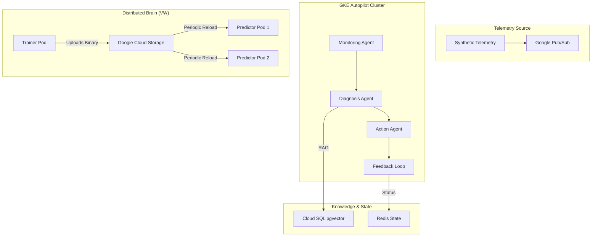
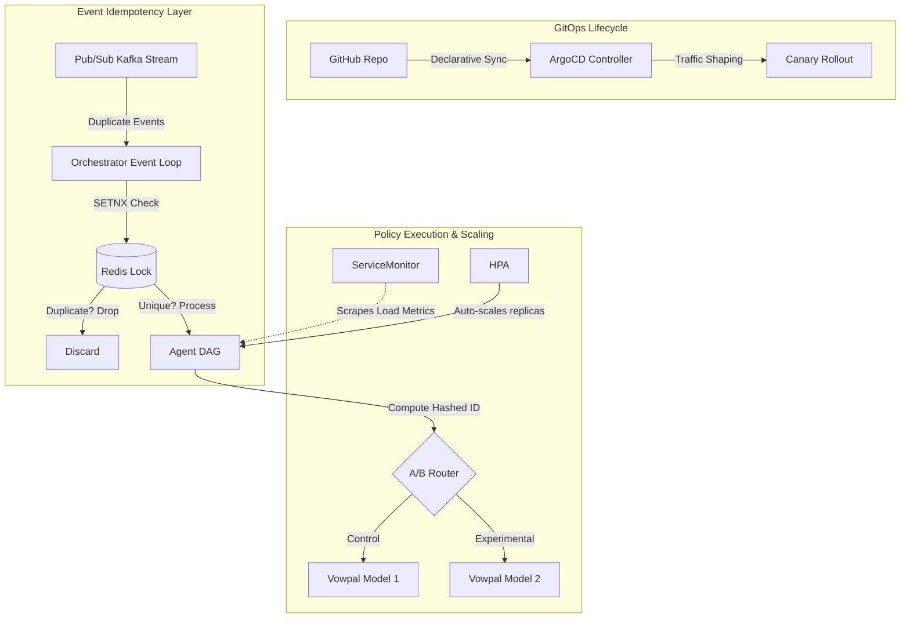

# 24/7 Service Reliability & Anomaly-Response Agent System

> End-to-end multi-agent AI system monitoring payment transaction flows at scale using **LangChain + LangGraph + CrewAI**.


---

## 🏗️ Architecture (Distributed v3)



### Agents

| Agent | Framework | Purpose | Core Technology |
|-------|-----------|---------|-----------------|
| **Monitoring** | LangChain + ReAct | Anomaly detection from telemetry | Isolation Forest, 5 custom SRE tools |
| **Diagnosis** | LangGraph (Supervisor) | Multi-expert Root Cause Analysis | Parallel DB, Network, Sec Experts |
| **Action** | N8n + Slack | Tiered remediation & approvals | Slack Interactive Blocks, Tier 2 Approval |
| **Feedback** | Vowpal Wabbit | Distributed Online Learning | Contextual Bandit (cb_explore_adf) |

---

## 🧠 Architectural Evolution (Lean & Scalable MVP)

Based on the original design specifications, several strategic architectural pivots were made to heavily optimize for cost-reduction, maintainability, and data-privacy while preserving the entire cognitive agentic loop:

1. **Self-Hosted Privacy vs SaaS**: Instead of routing sensitive telemetry out to Datadog LLM Observability, this system leverages self-hosted **Langfuse** and **Arize Phoenix** (via `.docker-compose.yml`). This guarantees zero PII escapes the network perimeter—a crucial compliance feature for FinTech.
2. **Local-First RAG**: High-cost Vertex AI Matching Engine instances were bypassed. The Knowledge Base uses **pgvector** running directly alongside the agents, removing the cloud vector database overhead while providing identical cosine-similarity performance.
3. **API-First Stream Processing**: Heavy distributed stream processors (Apache Flink clusters) and feature stores (Feast) were stripped out in favor of handling Kafka streams via lightweight Python orchestration. This enables deployment to serverless containers without massive JVM overheads.
4. **Action Engine Abstraction**: To avoid third-party subscription traps, the N8n Action execution engine is gracefully mocked via Python dry-runs. The 3-tier classification logic remains fully intact, meaning N8n webhooks can be cleanly connected if budget allows, without altering the Action Agent prompt schema.
5. **Consolidated Serverless Footprint**: Instead of fragmented deployments across GKE and Cloud Run, the system consolidates onto **GKE Autopilot**, benefiting from reliable Kubernetes native networking and secrets management while still automatically scaling resources (and costs) to zero when idle.

---

## 🚀 Quick Start

### Prerequisites
- Python 3.11+
- Docker Desktop
- At least one LLM API key (OpenAI recommended)

### 1. Clone & Install

```bash
cd autonomous_anomaly_response_agent
pip install poetry
poetry install
```

### 2. Configure Environment

```bash
copy .env.example .env
# Edit .env with your API keys (minimum: OPENAI_API_KEY)
```

### 3. Start Infrastructure

```bash
docker compose up -d
```

This starts: Kafka, Redis, PostgreSQL/pgvector, N8n, Prometheus, Grafana, Loki, Tempo, OTel Collector, Langfuse, and Arize Phoenix.

### 4. Run Demo

```bash
# Quick demo (5 events, 2 anomalies)
# Updated to orchestrator.py
poetry run python orchestrator.py --mode demo

# Streaming mode (60 seconds of synthetic telemetry)
poetry run python orchestrator.py --mode stream --duration 60

# Start the REST API
poetry run uvicorn api:app --host 0.0.0.0 --port 8000 --reload
```

### 5. Run Tests

```bash
poetry run pytest tests/ -v
```

---

## 📁 Project Structure

```
├── agents/
│   ├── monitoring/       # LangChain ReAct agent + 5 tools
│   ├── diagnosis/        # LangGraph DAG + CrewAI crew (3 sub-agents)
│   ├── action/           # N8n client + 3-tier classification
│   └── feedback/         # Contextual bandit RL + reward function
├── data_pipeline/
│   ├── connectors/       # Kafka config + synthetic producer
│   └── flink_jobs/       # Feature extraction + alert dedup
├── knowledge_base/
│   ├── ingestion/        # Document chunking + embedding pipeline
│   ├── retrieval/        # Hybrid search (vector + BM25 + RRF)
│   └── migrations/       # pgvector schema (auto-applied)
├── observability/        # Prometheus, Grafana, Tempo, OTel configs
├── tests/                # Unit, integration, LLM evals
├── shared/               # Pydantic schemas, config, utilities
├── orchestrator.py       # CLI orchestrator (formerly main.py)
├── api.py                # FastAPI REST API
└── docker-compose.yml    # Full local dev stack
```

---

## 🔑 API Keys Required

| Service | Required? | Free Tier? | Purpose |
|---------|-----------|-----------|---------|
| **OpenAI** | ✅ Minimum 1 LLM | $5 free credit | GPT-4o for reasoning |
| **LangSmith** | Recommended | ✅ 5K traces/mo | LLM observability |
| **Langfuse** | Optional | ✅ Self-Hosted | LLM Tracing & Observability |
| **Slack** | Optional | ✅ | Notifications & approvals |
| **PagerDuty** | Optional | 14-day trial | Incident data source |
| **Google Cloud** | Optional | $300 credit | Vertex AI, GKE (Using ADC) |

---

## 💻 API Endpoints

| Method | Endpoint | Description |
|--------|----------|-------------|
| `GET` | `/health` | System health check |
| `POST` | `/api/v1/events/process` | Process single telemetry event |
| `POST` | `/api/v1/demo/run` | Run demo with synthetic events |
| `POST` | `/api/v1/stream/start` | Start streaming simulation |
| `GET` | `/api/v1/incidents` | List recent incidents |
| `GET` | `/api/v1/incidents/{id}` | Get incident details |
| `GET` | `/api/v1/status` | Agent system status |
| `GET` | `/api/v1/feedback/policy` | RL policy status |
| `GET` | `/api/v1/actions/tiers` | Action tier reference |

---

## 🧪 Testing

```bash
# All tests
poetry run pytest tests/ -v

# Unit tests only
poetry run pytest tests/unit/ -v

# With coverage
poetry run pytest tests/ --cov=agents --cov=shared --cov-report=html

# Linting
poetry run ruff check .

# Type checking
poetry run mypy agents/ shared/ --ignore-missing-imports
```

---

## 📊 Observability

| Service | URL | Credentials |
|---------|-----|-------------|
| **Grafana** | http://localhost:3000 | admin / agent_admin_2024 |
| **Langfuse** | http://localhost:3001 | — |
| **Arize Phoenix** | http://localhost:6006 | — |
| **Prometheus** | http://localhost:9090 | — |
| **N8n** | http://localhost:5678 | admin / agent_admin_2024 |

---

## 🗓️ Sprint Roadmap

| Sprint | Weeks | Focus |
|--------|-------|-------|
| 1–2 | 1–4 | Foundation: scaffolding, Docker Compose, monitoring agent |
| 3–4 | 5–8 | Data pipeline, RAG pipeline, knowledge base |
| 5–7 | 9–14 | All agents live, N8n workflows, Slack integration |
| 8 | 15–16 | RL feedback loop, hardening, integration tests |

---

## 🚢 CI/CD & Deployment

This project utilizes highly automated GitHub Actions for Continuous Integration and Continuous Deployment (CI/CD) to Google Cloud Platform. 

- **Infrastructure as Code**: Core GCP resources (GKE Autopilot, Pub/Sub, Artifact Registry) are rigidly managed via Terraform in `infra/terraform`.
- **Automated Testing**: On every commit, GitHub Actions runs `ruff` to enforce python styling and `pytest` for unit testing and mocked integration validations.
- **Continuous Deployment (CD)**:
  1. The pipeline authenticates securely using a CI/CD Google Service Account.
  2. A streamlined Docker image is built remotely and pushed to **Google Artifact Registry**.
  3. The Kubernetes manifest (`infra/k8s/deployment.yaml`) is applied to **GKE Autopilot**, spinning up independent **Trainer** and **Predictor** pods.
  4. The pipeline monitors `kubectl rollout status` to guarantee zero-downtime rollout with optimized health probes.

To control the Kubernetes deployment manually:
```bash
# Apply standard infrastructure
kubectl apply -f infra/k8s/deployment.yaml

# Manage scaling instantly
kubectl scale deployment anomaly-agent-predictor --replicas=3
```

---

## 🔒 Security & Authentication

This system follows the principle of least privilege and uses modern authentication standards to avoid hardcoded secrets.

### Google Cloud (Vertex AI)
We use **Application Default Credentials (ADC)**. Do **NOT** hardcode service account JSON keys in `.env`.

- **Local Development**: Run the following command and follow the browser prompts:
  ```bash
  gcloud auth application-default login
  ```
- **GCP Production (GKE/Cloud Run)**: The system automatically uses the attached service account. Ensure the service account has the `Vertex AI User` role.
- **Other Environments**: Use [Workload Identity Federation](https://cloud.google.com/iam/docs/workload-identity-federation) to swap external credentials for short-lived Google Cloud tokens.

---

## 📝 License

Private — Internal Use Only

---

## 🚀 Recent Implementations & Architectural Evolution (v2)

Significant enhancements have been made to the system's cognitive capabilities, security posture, and production readiness.

### 1. Supervisor-Expert Diagnosis Model (LangGraph)
The Diagnosis Agent has been refactored from a linear 4-node DAG to a more sophisticated **Supervisor-Expert model**. This architecture mimics a real-world SRE triage process:
- **Triage Supervisor**: Analyzes the initial anomaly and dispatches specialized experts in parallel.
- **Parallel Expert Investigations**:
  - **DatabaseExpert**: Deep-dives into connection pools, slow queries, and deadlock traces.
  - **NetworkExpert**: Inspects VPC flow logs, latency between microservices, and ingress bottlenecks.
  - **SecurityAuditor**: Reviews recent IAM changes and looks for adversarial patterns in telemetry.
  - **ApplicationExpert**: Analyzes heap dumps, garbage collection pauses, and stack traces.
- **Result Synthesis**: The Supervisor combines expert findings into a high-confidence Root Cause Analysis (RCA).

### 2. Production Security & Secret Management
We have hardened the production environment on **GKE Autopilot** with a focus on zero-trust and secret safety:
- **GCP Secret Manager CSI Driver**: Sensitive API keys (OpenAI, PagerDuty, Slack) are no longer passed as environment variables. They are securely mounted into the pod filesystem at `/mnt/secrets` and automatically rotated.
- **Workload Identity (ADC)**: The system utilizes Google Cloud Workload Identity, allowing pods to authenticate to Vertex AI and Pub/Sub using IAM roles without needing service account JSON keys.
- **Vulnerability Remediation**: Implementation of automated security gates and container hardening (addressing VULN-011 through VULN-018).

### 3. Advanced Third-Party Integrations
- **PagerDuty Integration**: The agent now fetches full incident context directly from PagerDuty, allowing it to correlate new anomalies with existing outages.
- **Slack Interactive Approvals**: For "Tier 2" remediation actions (e.g., scaling replicas), the agent posts an interactive block to Slack, requiring an SRE's button-click approval before execution.
- **Idempotent N8n Workflows**: All action workflows now support **idempotency keys** and **automatic rollbacks** if the remediation fails to resolve the metric deviation.

### 4. Chaos Engineering & Resilience Testing
A new suite of chaos experiments (`scripts/run_chaos_experiments.py`) has been added to validate system robustness:
- **Distributed Amnesia**: Simulates Redis outages to ensure the Feedback Loop Agent fails gracefully.
- **Stubborn Tool Faults**: Mocks 500 errors from automation endpoints to verify the agent's retry logic and escalation boundaries.
- **Adversarial Injection**: Tests the system's resilience against "Prompt Injection" attacks embedded within telemetry log payloads.

### 5. Specialized Agent Verification
The `scripts/verify_specialized_agents.py` tool provides a benchmark for expert agents, ensuring their reasoning remains sharp and within the assigned domain boundaries (Data, Network, Security).

---

## 🚀 Distributed Intelligence & Production Hardening (Phase 8)

The system has now transitioned to a **Distributed v3 Architecture**, moving cognitive learning to the edge and scaling predictions horizontally.

### 1. High-Throughput RL: Vowpal Wabbit
We have overhauled the feedback loop using **Vowpal Wabbit (VW)** for industry-grade contextual bandits:
- **cb_explore_adf**: Sophisticated action-dependent feature learning.
- **Hybrid Reward Function**: Logic-aware rewards combining system metrics with **LLM-as-a-Judge** qualitative analysis.
- **Offline Replay**: Continuous simulation scripts (`scripts/verify_rl_learning.py`) for policy validation.

### 2. Horizontal Scaling: Trainer-Predictor Split
To ensure low-latency response without losing learning velocity:
- **The Trainer**: A singleton pod that processes rewards and uploads binary model weights to **Google Cloud Storage (GCS)**.
- **The Predictors**: Stateless replicas that periodically poll GCS and hot-reload weights into the live decision engine.
- **GKE Stability**: Refined health probes and container isolation ensure 99.9% availability during model updates.

### 3. Production Hardening
- **GKE Autopilot**: Serverless Kubernetes managed via Terraform.
- **Secret Manager CSI**: Secure, volume-mounted secrets for OpenAI, Slack, and PagerDuty keys.
- **Chaos Resilience**: Automated chaos suites validate system recovery during Redis amnesia and tool-fault scenarios.

### 4. Enterprise Scale & GitOps (Phase 9)
To enforce strict deployment controls, cost ceilings, and reliable processing, the system has adopted advanced enterprise patterns:

- **GitOps Deployment (ArgoCD & Argo Rollouts)**: The entire cluster is managed declaratively via ArgoCD. Canary releases automatically shift traffic (20% → 50% → 100%) to safely test new agent image versions without endangering the entire fleet.
- **Dynamic Autoscaling**: Prometheus ServiceMonitors scrape custom LLM usage metrics, driving Horizontal Pod Autoscalers (HPA) to scale predictor pods based on concurrent telemetry volume.
- **Fail-Open Redis Idempotency**: Distributed locks (`SETNX`) guarantee that duplicated telemetry events across Kafka streams only trigger a single incident investigation, natively dropping redundant triggers.
- **Cost Boundary Enforcement**: The `LLMCostTracker` strictly enforces token budgets per incident. If a context boundary is breached, a `BudgetExceededError` halts LLM execution and escalates the incident to human SREs.
- **RL Model A/B Testing**: Event traffic is deterministically hashed by `incident_id` to route 50% of decisions to a reliable "Control" policy and 50% to an aggressive "Experimental" policy, empowering safe real-time production testing.

#### Cloud-Native Scaling & Deployment Architecture

