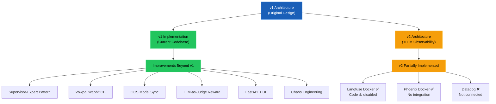

# 🔍 Autonomous Anomaly Response Agent — Architecture Audit

> **Scope**: Full validation of the original architecture (v1) and improved architecture (v2 + LLM Observability) against the implemented codebase. 
> **Audit Date**: April 11, 2026

---

## Executive Summary

This project is a **multi-agent AI system** for 24/7 payment transaction anomaly detection and autonomous remediation. Starting from a detailed 8-phase architecture, the team has built a remarkably functional end-to-end implementation that covers the core agent pipeline, production infrastructure on GKE, and a sophisticated RL feedback loop. The **v2 architecture** additions — LLM Observability via Langfuse/Phoenix/Datadog and the Supervisor-Expert pattern — represent genuine architectural improvements that have been partially integrated.

### Maturity Score Card

| Area | Score | Status |
|------|-------|--------|
| Agent Pipeline (Mon→Diag→Act→Feedback) | ⬛⬛⬛⬛⬜ 4/5 | **Functional** |
| LangGraph + Supervisor-Expert Pattern | ⬛⬛⬛⬛⬜ 4/5 | **Evolved from CrewAI** |
| Reinforcement Learning (VW Bandit) | ⬛⬛⬛⬛⬜ 4/5 | **Production-grade** |
| LLM Observability (Langfuse) | ⬛⬛⬛⬜⬜ 3/5 | **Scaffolded, partially wired** |
| RAG Pipeline (Knowledge Base) | ⬛⬛⬜⬜⬜ 2/5 | **Synthetic stubs only** |
| Data Pipeline (Flink/Kafka) | ⬛⬛⬜⬜⬜ 2/5 | **Connectors + local processing** |
| Infrastructure (GKE/Terraform) | ⬛⬛⬛⬛⬜ 4/5 | **Production deployed** |
| Testing (Unit/Integration/Chaos) | ⬛⬛⬛⬜⬜ 3/5 | **Good coverage, gaps in evals** |
| CI/CD (Cloud Build/GitHub Actions) | ⬛⬛⬜⬜⬜ 2/5 | **Basic, missing full pipeline** |
| Security (PII, mTLS, Vault) | ⬛⬛⬜⬜⬜ 2/5 | **Secret Manager only** |

---

## Phase-by-Phase Validation

### PHASE 00 — Research & Planning ✅ Complete

The architecture docs serve as the research artifact. All items are documented:

| Design Decision | Status | Notes |
|----------------|--------|-------|
| Domain & Pain Point Analysis | ✅ | Documented in both HTML files |
| Stakeholder Map | ✅ | 6 stakeholder groups identified |
| Technology Evaluation Matrix | ✅ | Updated in v2 with Langfuse row |
| Success Metrics & SLOs | ✅ | MTTA, MTTR, FP Rate, Data Quality |
| Risk Register | ✅ | Autonomous action, hallucination, RL drift |

---

### PHASE 01 — Data Architecture 🟡 Partially Implemented

| Component | Architecture | Implementation | Gap |
|-----------|-------------|----------------|-----|
| Kafka (KRaft) | ✅ Designed | ✅ [docker-compose.yml](file:///d:/Downloads/AmericanExpressProjects/agentic_ai/autonomous_anomaly_resposne_agent/docker-compose.yml) | None for local dev |
| Schema Registry | ✅ Designed | ✅ Confluent SR in compose | Working |
| Flink Transformation Jobs | ✅ Designed (4 jobs) | 🟡 [anomaly_features.py](file:///d:/Downloads/AmericanExpressProjects/agentic_ai/autonomous_anomaly_resposne_agent/data_pipeline/flink_jobs/anomaly_features.py) | Local Python, not real Flink |
| Kafka Connect / CDC | ✅ Designed | 🟡 `connectors/` dir exists | Stub configs only |
| Synthetic Telemetry Producer | Not in arch | ✅ Fully implemented | **Bonus** — excellent for testing |
| Google Pub/Sub | ✅ Designed | ✅ [pubsub.py](file:///d:/Downloads/AmericanExpressProjects/agentic_ai/autonomous_anomaly_resposne_agent/shared/pubsub.py) | Client implemented |
| pgvector / Vector Store | ✅ Designed | ✅ Docker + migrations dir | Schema present, retrieval is synthetic |
| Great Expectations | ✅ Designed | ❌ Not implemented | No data quality gates |
| dbt Models | ✅ Designed (repo structure) | ❌ Missing `dbt_models/` content | Empty directory |

> [!IMPORTANT]
> The **Flink transformation jobs** are implemented as lightweight Python classes (`RollingWindowAggregator`, `AlertDeduplicator`) rather than actual Apache Flink operators. This is a pragmatic choice for a portfolio project, but it means the architecture's streaming guarantees (watermarks, state eviction) are not realized.

---

### PHASE 02 — High-Level Design ✅ Mostly Complete

| Component | Architecture | Implementation | Gap |
|-----------|-------------|----------------|-----|
| 4-Agent Topology | ✅ Mon→Diag→Act→Feedback | ✅ [orchestrator.py](file:///d:/Downloads/AmericanExpressProjects/agentic_ai/autonomous_anomaly_resposne_agent/orchestrator.py) | Full pipeline working |
| LangGraph DAG | ✅ Designed | ✅ [graph.py](file:///d:/Downloads/AmericanExpressProjects/agentic_ai/autonomous_anomaly_resposne_agent/agents/diagnosis/graph.py) | 4-node graph compiled |
| Human-in-Loop Gate | ✅ Designed | ✅ Tier 2/3 classification | Slack approval flow coded |
| Audit & Explainability | ✅ Designed | 🟡 Logging exists, no queryable audit store | Missing immutable audit trail |
| Cross-Cutting: Security | ✅ Vault + mTLS + PII | 🟡 Secret Manager CSI only | No PII masking, no mTLS |
| Cross-Cutting: Observability | ✅ OTel + Grafana | ✅ Full stack in compose | Prometheus, Grafana, Tempo, Loki, OTel |
| Cross-Cutting: State Management | ✅ Redis + Postgres | ✅ Redis for VW, Postgres for KB | LangGraph checkpointing not to Redis |

---

### PHASE 03 — Low-Level Design ✅ Strong Implementation

This is where the codebase really shines.

#### Agent Internal Design

| Agent | Architecture Design | Implementation | Key Files |
|-------|-------------------|----------------|-----------|
| **Monitoring Agent** | LangChain ReAct + tools | ✅ ReAct loop with tool binding, 5-iteration cap | [agent.py](file:///d:/Downloads/AmericanExpressProjects/agentic_ai/autonomous_anomaly_resposne_agent/agents/monitoring/agent.py) |
| **Diagnosis Agent** | LangGraph DAG, 4 nodes, CrewAI sub-agents | ✅ **Evolved**: Supervisor-Expert pattern replaces CrewAI crew dispatch | [graph.py](file:///d:/Downloads/AmericanExpressProjects/agentic_ai/autonomous_anomaly_resposne_agent/agents/diagnosis/graph.py), [experts.py](file:///d:/Downloads/AmericanExpressProjects/agentic_ai/autonomous_anomaly_resposne_agent/agents/diagnosis/experts.py) |
| **Action Agent** | N8n + Tier Classification + Slack | ✅ 3-tier system with workflow triggers, PagerDuty, Slack notifications | [agent.py](file:///d:/Downloads/AmericanExpressProjects/agentic_ai/autonomous_anomaly_resposne_agent/agents/action/agent.py) |
| **Feedback Agent** | Vertex AI RL contextual bandit | ✅ **Evolved**: Vowpal Wabbit CB online learning + GCS model sync | [agent.py](file:///d:/Downloads/AmericanExpressProjects/agentic_ai/autonomous_anomaly_resposne_agent/agents/feedback/agent.py) |
| **Reward Agent** | Not in original arch | ✅ **NEW**: LLM-as-a-Judge evaluator (intrinsic reward) | [reward_agent.py](file:///d:/Downloads/AmericanExpressProjects/agentic_ai/autonomous_anomaly_resposne_agent/agents/feedback/reward_agent.py) |

#### Pydantic API Contracts

| Contract | Architecture | Implementation |
|----------|-------------|----------------|
| `AnomalyEvent` (Mon→Diag) | ✅ JSON schema | ✅ [schemas.py L83-105](file:///d:/Downloads/AmericanExpressProjects/agentic_ai/autonomous_anomaly_resposne_agent/shared/schemas.py#L83-L105) |
| `DiagnosisResult` (Diag→Act) | ✅ JSON schema | ✅ [schemas.py L137-158](file:///d:/Downloads/AmericanExpressProjects/agentic_ai/autonomous_anomaly_resposne_agent/shared/schemas.py#L137-L158) |
| `ActionResult` (Act→Feedback) | ✅ Implied | ✅ [schemas.py L164-178](file:///d:/Downloads/AmericanExpressProjects/agentic_ai/autonomous_anomaly_resposne_agent/shared/schemas.py#L164-L178) |
| `IncidentRecord` (Full lifecycle) | ✅ Implied | ✅ [schemas.py L184-210](file:///d:/Downloads/AmericanExpressProjects/agentic_ai/autonomous_anomaly_resposne_agent/shared/schemas.py#L184-L210) |
| `SemanticReward` (Reward Agent) | ❌ Not in arch | ✅ **NEW** [schemas.py L227-251](file:///d:/Downloads/AmericanExpressProjects/agentic_ai/autonomous_anomaly_resposne_agent/shared/schemas.py#L227-L251) |

#### RAG Pipeline

| Component | Architecture | Implementation |
|-----------|-------------|----------------|
| Document Processing (512-token chunks) | ✅ Designed | 🟡 Config present, [ingestion/](file:///d:/Downloads/AmericanExpressProjects/agentic_ai/autonomous_anomaly_resposne_agent/knowledge_base/ingestion) dir exists | 
| Hybrid Search (vector + BM25 + RRF) | ✅ Designed | ❌ **Not implemented** — uses synthetic runbook stubs |
| Cross-encoder Reranking | ✅ Designed | ❌ Missing |
| Metadata Filtering | ✅ Designed | ❌ Missing |

> [!WARNING]
> The RAG pipeline is the **single largest unimplemented component**. The diagnosis agent uses hardcoded synthetic runbooks (`_get_synthetic_runbooks()`) instead of actual vector search. This is the highest-impact gap to close.

---

### PHASE 04 — Development ✅ Well Executed

| Component | Architecture | Implementation |
|-----------|-------------|----------------|
| Repository Structure | ✅ Designed | ✅ **Matches exactly**: `agents/`, `data_pipeline/`, `knowledge_base/`, `automation/`, `infra/`, `tests/`, `observability/` |
| Structured Output Enforcement | ✅ Designed | ✅ Pydantic v2 models, JSON extraction with retry fallback |
| Tool Call Idempotency | ✅ Designed | 🟡 Workflow execution is idempotent via dry_run, but Redis distributed locks not implemented |
| Cost Budget Enforcement | ✅ 50K token cap | ✅ `LLMCostTracker` with per-agent tracking, `max_tokens_per_incident = 50_000` in config |
| Per-Agent Model Routing | ✅ Designed | ✅ [config.py L39-42](file:///d:/Downloads/AmericanExpressProjects/agentic_ai/autonomous_anomaly_resposne_agent/shared/config.py#L39-L42): `monitoring→gpt-4o-mini`, `diagnosis→gpt-4o`, etc. |

---

### PHASE 05 — Testing 🟡 Partial Coverage

| Test Type | Architecture | Implementation | Files |
|-----------|-------------|----------------|-------|
| Unit Tests (pytest) | ✅ 4 categories | ✅ 4 test files | `test_schemas.py`, `test_tools.py`, `test_reward_and_tiers.py`, `test_data_pipeline.py` |
| Integration Tests | ✅ Agent-to-agent chain | ✅ 2 test files | `test_contract.py`, `test_integration.py` |
| LLM Evals (golden dataset) | ✅ 200-case eval set | 🟡 Stub only | `test_evals.py` (1.2KB — minimal) |
| Chaos Engineering | ✅ Litmus/Chaos Monkey | ✅ Custom implementation | [run_chaos_experiments.py](file:///d:/Downloads/AmericanExpressProjects/agentic_ai/autonomous_anomaly_resposne_agent/scripts/run_chaos_experiments.py) |
| Load Testing (k6/Locust) | ✅ Designed | 🟡 `tests/load/` dir exists | Content unknown |
| Property-based (Hypothesis) | ✅ Designed | 🟡 `hypothesis` in dev-deps | Not actively used in test files |
| Adversarial Prompt Tests | ✅ Designed | ❌ Not implemented | — |

---

### PHASE 06 — Production ✅ Strong

| Component | Architecture | Implementation | Key Files |
|-----------|-------------|----------------|-----------|
| CI/CD Pipeline | ✅ 8-step pipeline | 🟡 Cloud Build only | [cloudbuild.yaml](file:///d:/Downloads/AmericanExpressProjects/agentic_ai/autonomous_anomaly_resposne_agent/cloudbuild.yaml) |
| GKE Autopilot | ✅ Designed | ✅ Deployed | [deployment.yaml](file:///d:/Downloads/AmericanExpressProjects/agentic_ai/autonomous_anomaly_resposne_agent/infra/k8s/deployment.yaml) |
| Terraform IaC | ✅ GKE, Spanner, PubSub | ✅ Applied with plan files | [main.tf](file:///d:/Downloads/AmericanExpressProjects/agentic_ai/autonomous_anomaly_resposne_agent/infra/terraform/main.tf) |
| Secret Manager CSI | ✅ Vault designed | ✅ **Pragmatic swap**: GCP Secret Manager | [secret-provider.yaml](file:///d:/Downloads/AmericanExpressProjects/agentic_ai/autonomous_anomaly_resposne_agent/infra/k8s/secret-provider.yaml), [config.py L196-216](file:///d:/Downloads/AmericanExpressProjects/agentic_ai/autonomous_anomaly_resposne_agent/shared/config.py#L196-L216) |
| K8s Production Manifests | ✅ Helm designed | ✅ Raw YAML + prod variant | `deployment-prod.yaml`, `service-prod.yaml`, `auth.yaml` |
| Trainer-Predictor Distributed VW | Not in arch | ✅ **NEW** GCS model sync | [agent.py L69-81](file:///d:/Downloads/AmericanExpressProjects/agentic_ai/autonomous_anomaly_resposne_agent/agents/feedback/agent.py#L69-L81), `VW_IS_TRAINER` env var |
| Canary / Blue-Green | ✅ Designed | ❌ Not implemented | No Argo Rollouts or Istio |
| Docker Multi-stage | ✅ Implied | ✅ `infra/docker/` dir | Dockerfile present |

---

### PHASE 07 — Post-Production 🟡 Documented but Not Instrumented

| Component | Architecture | Implementation |
|-----------|-------------|----------------|
| Grafana Dashboards | ✅ MTTA/MTTR/FPR/Auto-Resolved | 🟡 Grafana running, provisioning dir exists, no custom dashboards |
| Weekly Operations Review | ✅ Designed | ❌ No automation — manual process |
| Monthly Model Governance | ✅ Designed | ❌ No automation |
| Scaling Roadmap (M3/M6/M9/M12) | ✅ Designed | ❌ Future planning only |

---

### PHASE 08 — LLM Observability (v2 Addition) 🟡 Scaffolded

This is the **major architectural improvement** in the v2 document.

| Component | v2 Architecture | Implementation | Gap |
|-----------|----------------|----------------|-----|
| Langfuse (Primary, self-hosted) | ✅ Deep design | ✅ Docker service + config wired | `CallbackHandler` referenced but **import commented out** ("Langfuse decoupled") |
| Arize Phoenix (RAG evals) | ✅ Deep design | ✅ Docker service running | **No code integration** — spans not forwarded |
| Datadog LLM Obs (SaaS SRE view) | ✅ Designed as downstream | ❌ Not connected | Sanitized OTLP export not configured |
| Per-agent session scoping | ✅ `session_id=incident_id` | ✅ Code present but **conditionally disabled** | Langfuse flag check exists |
| Prompt Version Registry | ✅ Designed | 🟡 Hardcoded version strings in metadata | Not using Langfuse prompt management |
| RAG Quality Monitoring | ✅ 5 metrics with alert thresholds | ❌ Not implemented | Phoenix not receiving RAG spans |
| Production Alert Rules | ✅ 9 detailed P0/P1/P2 alerts | ❌ Not implemented | No alerting configuration |
| Incident Audit Replay API | ✅ API spec designed | ❌ Not implemented | No `/api/v1/sessions/{incident_id}` endpoint |
| LLM Cost Dashboard | ✅ Designed | 🟡 `LLMCostTracker` tracks internally | Not surfaced in Langfuse/Grafana |

> [!NOTE]
> The Langfuse integration code is **present throughout the agents** (monitoring, diagnosis, action) with proper `CallbackHandler` initialization, session scoping, and metadata — but the `import` line is **commented out** with the note "Langfuse decoupled". This suggests a deliberate decision to decouple during debugging/deployment, and re-enabling it is likely a small lift.

---

## 🆕 Improvements Beyond the Original Architecture

These are features that exist in the **code but NOT in the original v1 architecture**:

| Improvement | Description | Impact |
|-------------|-------------|--------|
| **Supervisor-Expert Pattern** | Replaced CrewAI crew dispatch with a LLM-powered Supervisor that triages and dispatches domain Experts (DB, Network, Security, Application) in parallel | High — cleaner, more controllable than CrewAI |
| **Vowpal Wabbit Contextual Bandits** | Replaced planned Vertex AI RL with VW `cb_explore_adf` for online learning — trains on every incident | High — lower latency, no batch training needed |
| **GCS Model Synchronization** | Trainer-Predictor distributed architecture for VW models with periodic GCS sync | High — enables horizontal scaling |
| **LLM-as-a-Judge Reward Agent** | Added a dedicated `RewardAgent` using GPT-4o to evaluate resolution quality on 3 dimensions | High — closes the semantic gap in reward signal |
| **Hybrid Reward Function** | Combines extrinsic metrics (MTTR, FP rate) with intrinsic LLM evaluation | Medium — richer reward shaping |
| **FastAPI REST API** | Full API server with 10+ endpoints for events, incidents, demos, streaming, and approvals | Medium — enables UI and external integration |
| **Web UI Dashboard** | Static UI served from `/ui/` | Medium — operational visibility |
| **Synthetic Telemetry Producer** | Generates realistic anomaly patterns for testing without production data | Medium — essential for CI/CD |
| **Google Pub/Sub Client** | Production alternative to local Kafka | Medium — cloud-native event bus |
| **Chaos Engineering Suite** | Custom resilience testing script | Medium — validates fault tolerance |

---

## 🔴 Critical Gaps — What's Still Missing

### Priority 1 (High Impact, Achievable)

| Gap | Architecture Ref | Effort | Why It Matters |
|-----|-----------------|--------|----------------|
| **RAG Pipeline — Real Vector Search** | Phase 03: RAG Pipeline | 2-3 days | The diagnosis agent is blind without real runbook retrieval. The pgvector DB is running, embeddings config is set — just needs the ingestion+retrieval code |
| **Re-enable Langfuse Integration** | Phase 08: All sections | 1 day | The code is already written and conditionally disabled. Fix the import, verify connectivity to the Langfuse Docker service, and the entire Phase 08 observability layer activates |
| **LangGraph Redis Checkpointing** | Phase 02: State Management | 1 day | Architecture specifies Redis checkpoints for in-flight state. Currently no checkpointing — graph state is lost on crash |

### Priority 2 (Medium Impact)

| Gap | Architecture Ref | Effort | Why It Matters |
|-----|-----------------|--------|----------------|
| **PII Masking Middleware** | Phase 02: Security | 2 days | Architecture mandates PII tokenization before LLM calls. Currently no masking — card numbers, merchant IDs sent raw |
| **LLM Eval Golden Dataset** | Phase 05: Testing | 3 days | The 200-case golden dataset for LLM-as-judge scoring is not created. `test_evals.py` is a stub |
| **Custom Grafana Dashboards** | Phase 07: Post-Production | 2 days | Grafana is running but has no agent-specific dashboards for MTTA/MTTR/Cost/FPR |
| **GitHub Actions CI Pipeline** | Phase 06: CI/CD | 1 day | `.github/workflows/` directory exists but empty. `cloudbuild.yaml` is minimal |
| **Arize Phoenix RAG Span Forwarding** | Phase 08: Phoenix Integration | 2 days | Phoenix container runs but receives no data. Need OTLP export from Langfuse RAG spans |

### Priority 3 (Lower Impact / Future)

| Gap | Architecture Ref | Effort | Why It Matters |
|-----|-----------------|--------|----------------|
| Helm Charts | Phase 06: Helm | 3 days | `helm_charts/` dir is empty — using raw K8s YAML |
| Redis Distributed Locks (Idempotency) | Phase 04: Dev Patterns | 1 day | Tool call idempotency via Redis locks not implemented |
| ArgoCD GitOps | Phase 06: CI/CD | 3 days | No GitOps reconciliation loop |
| Canary/Blue-Green Releases | Phase 06: Release Strategy | 3 days | No traffic splitting or progressive rollout |
| RL Policy A/B Testing | Phase 03: Feedback Agent | 3 days | VW learns online but no A/B framework for policy candidates |
| Cost Budget Hard Enforcement | Phase 04: Dev Patterns | 1 day | `max_tokens_per_incident` is tracked but not enforced as a circuit breaker |

---

## 🚀 Recommended Next Steps (Prioritized)

### Horizon 1 — Next 1-2 Weeks (Highest ROI)

1. **Re-enable Langfuse** — Fix the import, test against the already-running Docker service. This alone activates ~60% of Phase 08.

2. **Implement Real RAG Retrieval** — Wire up the `knowledge_base/retrieval/` module to actually query pgvector. Ingest the synthetic runbooks from `_get_synthetic_runbooks()` as actual embedded documents. This transforms the Diagnosis Agent from a demo into a functional RAG system.

3. **Add LangGraph Redis Checkpointing** — Use `langgraph`'s built-in `RedisCheckpoint` with the existing Redis instance. One-line change in `build_diagnosis_graph()`.

### Horizon 2 — Weeks 3-4

4. **Build the Golden Eval Dataset** — Create 50-100 (anomaly_input, expected_diagnosis) pairs. Wire into `test_evals.py` with LLM-as-judge scoring. This is critical for CI gating prompt changes.

5. **PII Masking Middleware** — Add a `sanitize_prompt()` utility that tokenizes card numbers, merchant IDs, and customer data before any LLM call. Apply as a decorator or LangChain callback.

6. **GitHub Actions CI** — Create a workflow that runs `pytest`, `ruff`, and the eval suite on every PR. Block merge if eval regression >5%.

7. **Custom Grafana Dashboards** — Build 2-3 operational panels: Agent Pipeline Latency (p50/p95/p99), Per-Incident Cost, and Feedback Loop Reward Trend.

### Horizon 3 — Month 2+

8. **Arize Phoenix Integration** — Forward RAG spans from Langfuse to Phoenix. Set up the 5 RAG quality monitoring metrics from Phase 08.

9. **Helm Charts + ArgoCD** — Package the K8s manifests as Helm charts. Set up ArgoCD for GitOps deployment to GKE.

10. **RL Policy A/B Framework** — Implement a feature-flag mechanism in Redis that allows running two VW policies simultaneously and comparing rewards before promotion.

---

## Architecture Evolution Summary

> [!TIP]
> The project is in an excellent state for a portfolio piece. The three highest-ROI next steps — **re-enabling Langfuse**, **wiring real RAG**, and **adding Redis checkpointing** — are each approximately 1-day efforts that would upgrade the project from "strong demo" to "production-ready reference architecture."
